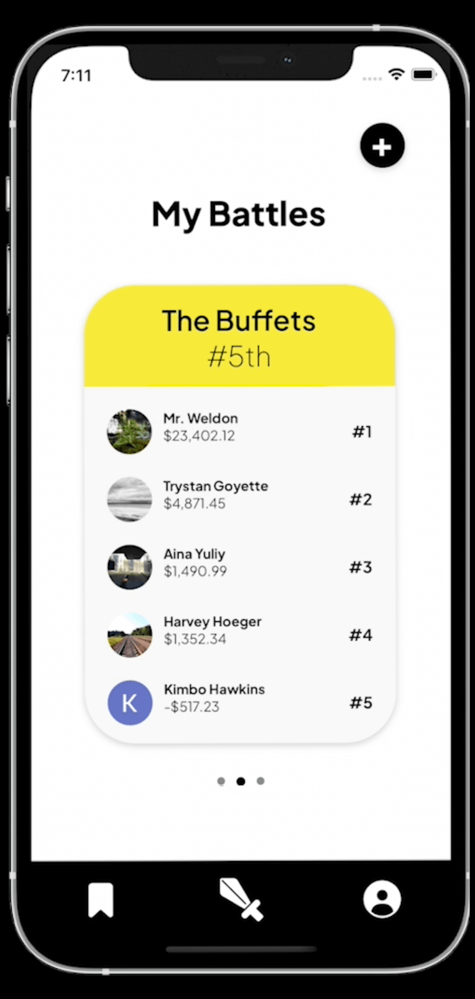
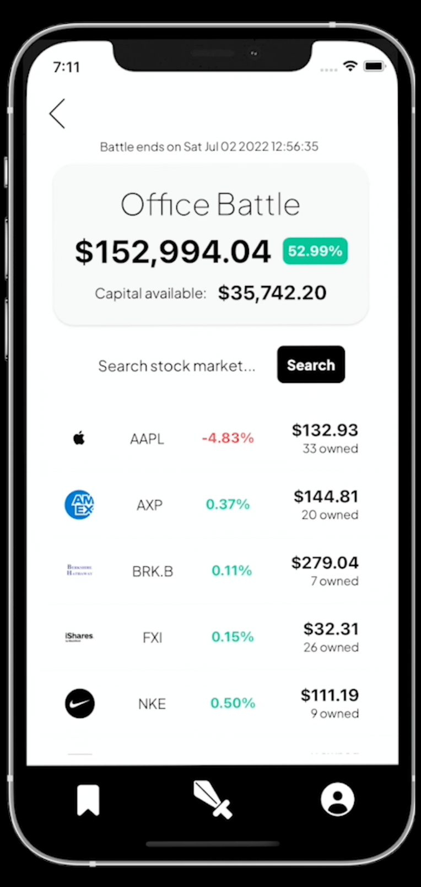
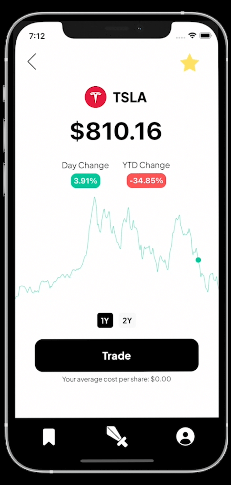
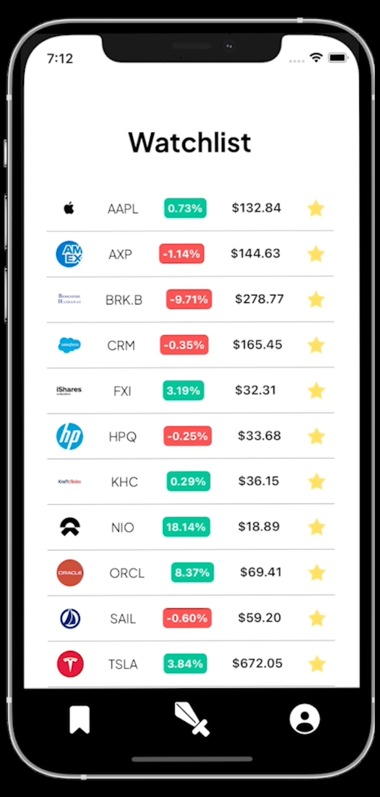

# Trade Battles

## Description

Trade Battles is an exhilarating game that will put your inner stock trader to the test. Create battles with your friends and
figure out who is the best trader. Each of the contestants will start out with $100,000 USD that they will be able to use throughout
the battle to buy and sell real-time stocks. The battle duration will be set by the battle creator and at the end of the battle the person
with the most profit will be the winner.

## Tech stack

### Front-end

  
  

### Back-end

  
  
  
  

## Demo 

I made a youtube video where I do a brief walkthrough of the app:

- https://www.youtube.com/watch?v=Mu79HIkxhPE

Here are some screenshots of the app as well 😃.

  
  
  
  

## APIs Used

### IEX Cloud

- IEX Cloud is a company that aims to level the trading playing field for long-term investors with real-time data of the markets.
- Trade battles relies heavily on this API and you can get a free API key on this link https://iexcloud.io/

### Polygon.io

- Polygon.io handles the heavy lifting of fetching accurate, reliable and real-time financial data for developers to use on their applications.
- Trade battles makes use of Polygon.io through a free API key that can be created on this link https://polygon.io/

## Dependencies

## Intended Audience

## People involved

## Screenshots of the app

## How to run a local copy of this app

xcode

For the app to work it needs two api keys that are inside /server/models/config

The first one you can get from https://iexcloud.io
The second one from https://polygon.io

For the database you will need 3 tables: users, battles and transactions.

users:

user_id: text PRIMARY KEY
first_name: text
last_name: text
battles: text[]
transactions: text[]
photo: text
email: text
current_gain_loss: jsonb
watchlist: text[]

battle columns:

battle_id: text PRIMARY KEY
battle_members: text[]
start_date_timestamp: text
end_date_timestamp: text
battle_name: text

transactions:

transaction_id: text PRIMARY KEY
battle_id: text
user_id: text
action: text
symbol: text
price: numeric
quantity: numeric
transaction_timestamp: text
